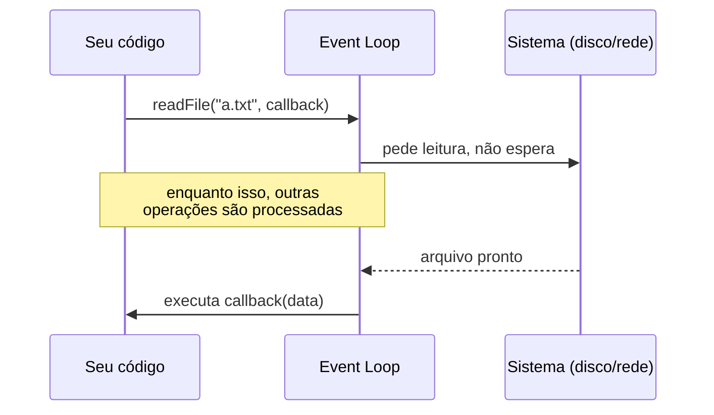
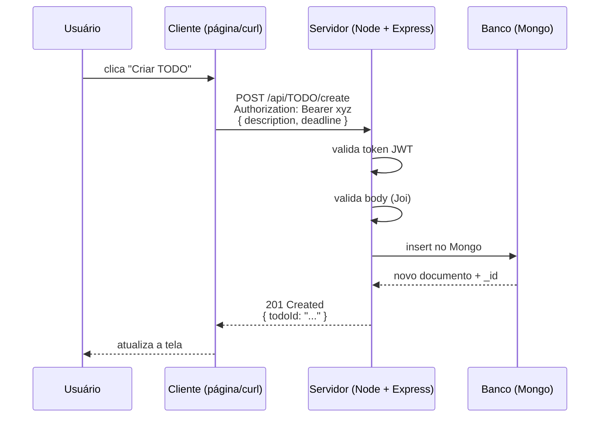
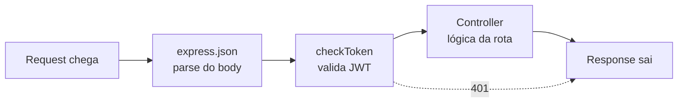
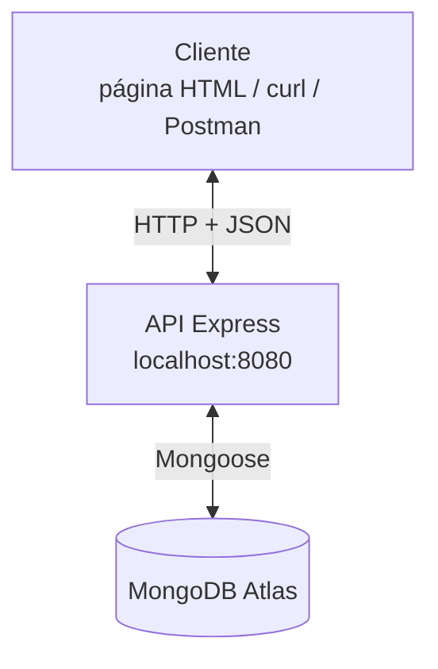
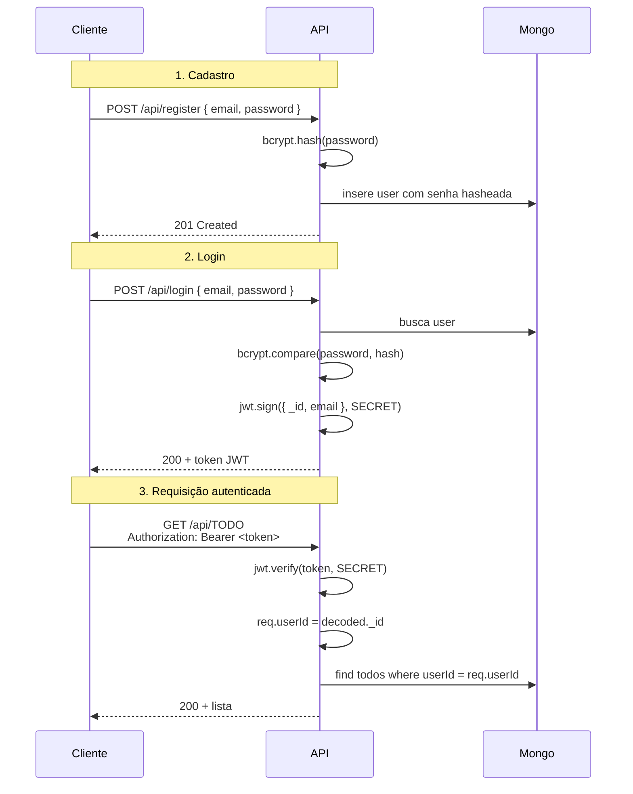
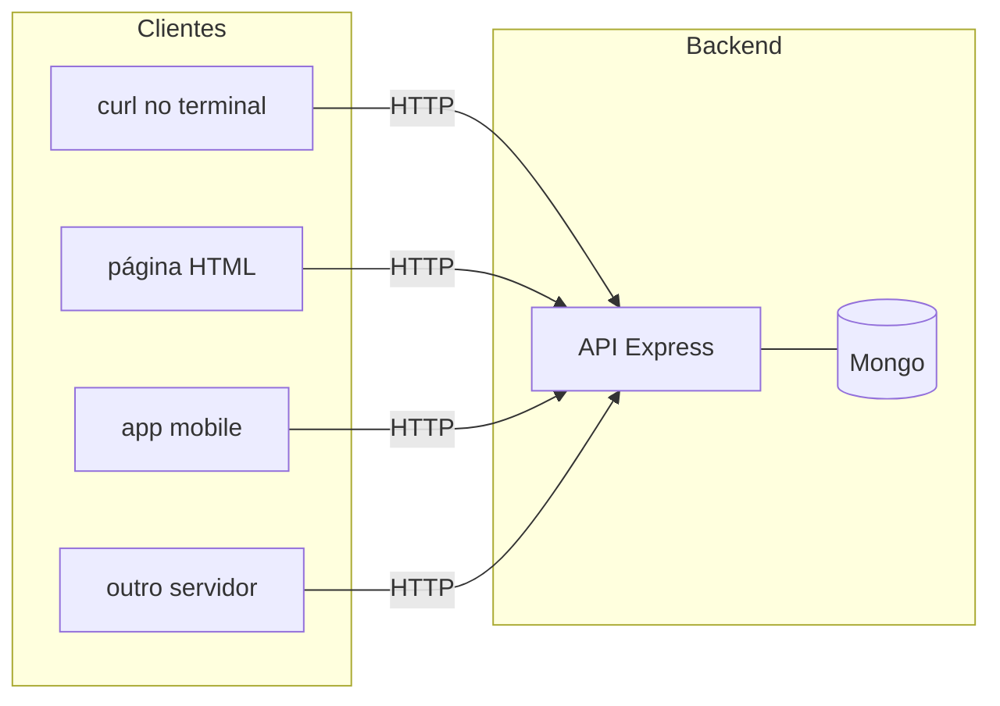
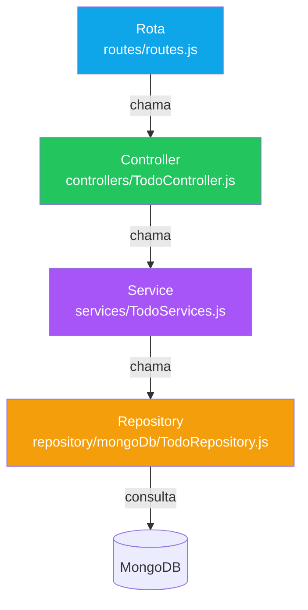
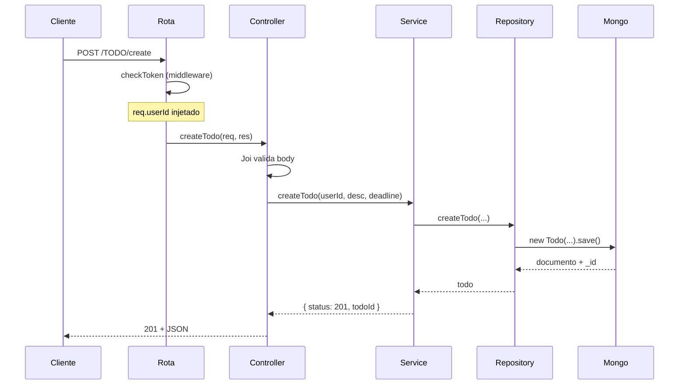
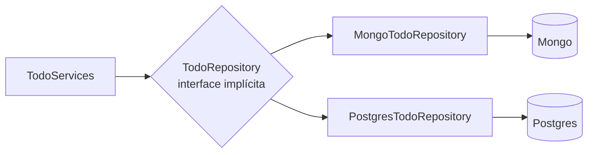
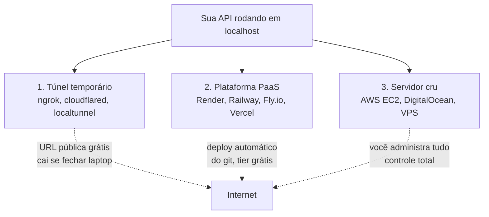

# Hands-on Node.js, APIs e CRUD com Express

> Material da apresentação para a **Átria Jr. — UNICAMP**.
> Esse arquivo serve durante o hands-on **e** depois dele, como referência.
> Repositório: `TODO-api` (clone, mexa, quebre — é pra isso que está aqui).

---

## Sumário

1. [O que você vai aprender](#1-o-que-você-vai-aprender)
2. [Node.js: JavaScript fora do navegador](#2-nodejs-javascript-fora-do-navegador)
3. [O que é uma API? E o que é REST?](#3-o-que-é-uma-api-e-o-que-é-rest)
4. [Express.js em uma página](#4-expressjs-em-uma-página)
5. [Tour pela API TODO](#5-tour-pela-api-todo)
6. [Arquitetura em camadas](#6-arquitetura-em-camadas)
7. [De `localhost` pra internet](#7-de-localhost-pra-internet)
8. [Glossário](#8-glossário)
9. [Pra continuar estudando](#9-pra-continuar-estudando)

---

## 1. O que você vai aprender

Nesta apresentação, a gente vai responder, na prática, três perguntas:

1. **O que é Node.js** e por que JavaScript foi parar no servidor?
2. **O que é uma API REST** e como ela conecta cliente e banco de dados?
3. **Como um projeto Node real é organizado** (rotas, controllers, services, repositórios)?

Não precisa instalar nada agora. Você sai daqui com um repositório completo (esse aqui) que dá pra clonar, rodar e estudar com calma.

---

## 2. Node.js: JavaScript fora do navegador

### A história curta

JavaScript nasceu em 1995 pra rodar **dentro do navegador**. Em 2009, um engenheiro chamado Ryan Dahl pegou o motor V8 (o mesmo que faz o Chrome executar JS) e empacotou ele pra rodar no terminal. Esse pacote é o **Node.js**.

A consequência: o mesmo JS que você usa pra mexer no DOM (Document Object Model) agora roda servidor, escreve arquivo no disco, abre conexão com banco — tudo que qualquer linguagem "de servidor" faz.

### Runtime, não linguagem

```text
JavaScript        →  a linguagem (sintaxe, semântica)
V8                →  o motor que executa JS (transforma código em instruções de CPU)
Node.js           →  V8 + APIs de sistema (fs, net, http, ...) = runtime de servidor
```

Quando você fala "estou escrevendo Node", está escrevendo **JavaScript** sendo executado **fora do navegador**, com acesso a coisas que o navegador não te dá (arquivos, sockets de baixo nível, processos).

### O event loop em uma frase

Node executa **uma coisa por vez** (single-threaded), mas **não trava** esperando I/O. Quando você pede pra ler um arquivo ou abrir conexão com banco, Node agenda a operação e segue a vida. Quando a resposta chega, ele volta no callback / `await` / `.then`.



É por isso que Node é bom pra coisas com muito I/O (servidor web, gateway de API) e ruim pra coisas com muita CPU (processamento de imagem, ML pesado).

### npm e o `package.json`

`npm` é o gerenciador de pacotes do Node. Cada projeto tem um `package.json` listando dependências.

```json
{
  "scripts": {
    "start": "node ./src/server.js",
    "dev": "nodemon ./src/server.js"
  },
  "dependencies": {
    "express": "^4.18.2",
    "mongoose": "^8.8.3"
  },
  "devDependencies": {
    "jest": "^29.6.1"
  }
}
```

- `dependencies` → pacotes necessários **em produção**.
- `devDependencies` → só pra desenvolver (testes, hot-reload).
- `npm install` baixa tudo em `node_modules/`.
- `npm run dev` executa o script nomeado.

---

## 3. O que é uma API? E o que é REST?

### Analogia do garçom

Você está num restaurante. **Você é o cliente.** A **cozinha** é o banco de dados — fica longe, ninguém te deixa entrar. Entre os dois, o **garçom** anota seu pedido, leva pra cozinha, e traz a resposta. Esse garçom é a **API**.

Vantagens:

- Quem está na mesa não precisa saber como a cozinha funciona.
- A cozinha pode mudar (trocar fogão, contratar chef novo) sem afetar o cliente.
- Se mais clientes chegarem, contrata mais garçons — não mais cozinheiros.

### HTTP em 1 minuto

Toda requisição HTTP tem 4 ingredientes:

| Parte | Exemplo | Significa |
| --- | --- | --- |
| **Método** | `POST` | O verbo: que tipo de operação. |
| **URL/Path** | `/api/TODO/create` | O recurso: o "endereço" do que você quer. |
| **Headers** | `Authorization: Bearer xyz` | Metadados (autenticação, formato esperado, ...). |
| **Body** | `{ "description": "...", "deadline": "..." }` | A carga útil (só em alguns métodos). |

E toda resposta tem:

- **Status code** (`200`, `404`, `500`, ...) — o resumo numérico do que aconteceu.
- **Headers** (formato, cookies, ...).
- **Body** — o conteúdo.

### Status codes que valem decorar

| Faixa | O quê | Exemplos |
| --- | --- | --- |
| `2xx` | Deu certo | `200 OK`, `201 Created`, `204 No Content` |
| `3xx` | Redirect | `301 Moved Permanently`, `304 Not Modified` |
| `4xx` | Cliente errou | `400 Bad Request`, `401 Unauthorized`, `403 Forbidden`, `404 Not Found`, `409 Conflict` |
| `5xx` | Servidor explodiu | `500 Internal Server Error`, `503 Service Unavailable` |

**Regra de ouro:** `4xx` = "o problema foi quem perguntou". `5xx` = "o problema foi quem respondeu".

### REST e CRUD

**CRUD** é o acrônimo das 4 operações que você faz em qualquer banco:

- **C**reate (criar)
- **R**ead (ler)
- **U**pdate (atualizar)
- **D**elete (deletar)

**REST** é uma convenção sobre como mapear CRUD em HTTP:

| Operação | Verbo HTTP | Exemplo |
| --- | --- | --- |
| Create | `POST` | `POST /api/todos` |
| Read | `GET` | `GET /api/todos` ou `GET /api/todos/123` |
| Update | `PUT` ou `PATCH` | `PUT /api/todos/123` |
| Delete | `DELETE` | `DELETE /api/todos/123` |

Esse projeto não segue REST 100% (usa `POST /api/TODO/create` em vez de `POST /api/todos`), mas o conceito é o mesmo.

### JSON

A linguagem com que cliente e servidor combinam de conversar. Veio do JS, mas hoje todo mundo usa.

```json
{
  "description": "Estudar para a P2",
  "deadline": "2026-06-01T00:00:00.000Z",
  "tags": ["urgente", "prova"],
  "concluido": false
}
```

### Diagrama: uma requisição do começo ao fim



---

## 4. Express.js em uma página

### O problema que o Express resolve

Node tem um módulo `http` nativo, mas usar ele direto é verboso: você lê headers crus, parseia o body byte a byte, monta resposta string a string. **Express** é uma biblioteca em cima do `http` que cuida da chatice e te dá uma API limpa pra registrar rotas e middlewares.

### Anatomia do `src/app.js`

```js
const express = require("express");           // (1) importa a lib
require("express-async-errors");              //     pega erros de funções async automaticamente
const routes = require("./routes/routes");    //     nossas rotas
const app = express();                        // (2) cria a aplicação Express
require("dotenv").config();                   // (3) carrega variáveis do .env

require("./db/mongoose");                     // (4) conecta no MongoDB

app.use(express.json());                      // (5) middleware: parse JSON do body

app.get("/api/health", (req, res) => {        // (6) rota: GET /api/health
  res.status(200).json({ message: "OK" });
});

app.use("/api", routes);                      // (7) plug do roteador em /api/*

app.use((err, req, res, next) => {            // (8) handler global de erro
  res.status(err.statusCode || 500).json({ message: err.message });
});

module.exports = app;
```

### O conceito mais importante: middleware

**Middleware** é uma função `(req, res, next)` que fica no meio do caminho entre a requisição chegar e a resposta sair. Ela pode:

- Ler/modificar o `req` (ex: parsear JSON, decodificar token).
- Cortar com uma resposta (ex: rejeitar não autenticado).
- Chamar `next()` pra passar pro próximo da fila.

Imagine uma esteira de produção. A requisição entra de um lado e a resposta sai do outro. Cada middleware é um operário com uma função específica.



A linha pontilhada mostra: se o `checkToken` recusar, ele já responde 401 e o controller **nunca executa**.

### Router

`app.use("/api", routes)` quer dizer: "Aplique esse roteador em tudo que começar com `/api`". Dá pra ter vários roteadores (`/api/v1`, `/admin`, ...) com prefixos diferentes — é como modulariza projetos grandes.

Em `src/routes/routes.js`:

```js
router.post("/register", userController.createUser);
router.post("/TODO/create", checkToken, todoController.createTodo);
//                          ^^^^^^^^^^ middleware antes do controller
```

A rota `POST /TODO/create` tem **dois passos**: primeiro `checkToken`, depois `createTodo`. Se o primeiro chamar `next()`, o segundo executa. Se cortar com 401, fica nele mesmo.

---

## 5. Tour pela API TODO

### O que ela faz

É uma API REST que permite gerenciar listas de tarefas. Os usuários se cadastram, fazem login (recebem um token), e criam/listam/editam/concluem tarefas. Cada usuário só vê as próprias tarefas.

### Visão geral



### Os 6 endpoints

| # | Método | Path | Autenticado? | O que faz |
| --- | --- | --- | --- | --- |
| 1 | `POST` | `/api/register` | Não | Cria um usuário |
| 2 | `POST` | `/api/login` | Não | Devolve um JWT |
| 3 | `POST` | `/api/TODO/create` | Sim | Cria uma tarefa |
| 4 | `GET` | `/api/TODO` | Sim | Lista as tarefas do usuário |
| 5 | `PUT` | `/api/TODO/edit` | Sim | Edita uma tarefa aberta |
| 6 | `PUT` | `/api/TODO/close` | Sim | Marca como concluída |

### Fluxo de autenticação (JWT)



### O que é um JWT, sem mistério

Um JWT é uma string com **três partes separadas por ponto**:

```text
header.payload.signature
```

- **Header**: tipo (`JWT`) e algoritmo (`HS256`).
- **Payload**: dados arbitrários que **qualquer um consegue ler**. Aqui guardamos `{ _id: "...", email: "...", exp: ... }`.
- **Signature**: hash dos dois primeiros + segredo. Garante que ninguém alterou o payload.

> **Importante:** JWT **não esconde** nada. Ele **autentica** — prova que o servidor emitiu aquele token. Cola um JWT em <https://jwt.io> e você lê o payload limpinho. Por isso nunca coloque senha no payload.

### Os comandos `curl` (cola pra você praticar depois)

```bash
# 1. Healthcheck
curl http://localhost:8080/api/health

# 2. Cadastro
curl -X POST http://localhost:8080/api/register \
  -H "Content-Type: application/json" \
  -d '{ "email": "atria@unicamp.br", "password": "senha12345" }'

# 3. Login (guarde o token!)
curl -X POST http://localhost:8080/api/login \
  -H "Content-Type: application/json" \
  -d '{ "email": "atria@unicamp.br", "password": "senha12345" }'

# salve o token numa variável de shell:
TOKEN="cole_o_token_aqui"

# 4. Criar TODO
curl -X POST http://localhost:8080/api/TODO/create \
  -H "Content-Type: application/json" \
  -H "Authorization: Bearer $TOKEN" \
  -d '{ "description": "Estudar Node", "deadline": "2026-06-01T00:00:00.000Z" }'

# 5. Listar TODOs
curl http://localhost:8080/api/TODO -H "Authorization: Bearer $TOKEN"

# 6. Editar (use o todoId que veio da criação)
curl -X PUT http://localhost:8080/api/TODO/edit \
  -H "Content-Type: application/json" \
  -H "Authorization: Bearer $TOKEN" \
  -d '{ "todoId": "<TODO_ID>", "newDescription": "Estudar Node + Express" }'

# 7. Concluir
curl -X PUT http://localhost:8080/api/TODO/close \
  -H "Content-Type: application/json" \
  -H "Authorization: Bearer $TOKEN" \
  -d '{ "todoId": "<TODO_ID>" }'
```

### Cliente HTML em `public/index.html`

Abra `http://localhost:8080/` no navegador. A página estática faz **exatamente as mesmas chamadas** do `curl` acima, usando `fetch()`. O painel direito ("Console HTTP") mostra cada request e resposta — é a mesma coisa, com botão.

**Lição:** o backend não muda. Cliente é qualquer coisa que respeita o contrato.



---

## 6. Arquitetura em camadas

### O problema

Se você colocar tudo dentro de `app.js` — validar body, falar com banco, criptografar senha, formatar resposta — o arquivo vira monstro. Mudar uma coisinha quebra três outras. Testar requer subir banco. Trocar Mongo por Postgres é dor de cabeça.

### A solução: separar por responsabilidade



| Camada | Responsabilidade | O que **não** sabe |
| --- | --- | --- |
| **Rota** | Mapear URL+verbo → função. Plugar middlewares. | Regras de negócio, banco. |
| **Controller** | Ler `req`, validar body (Joi), chamar service, formatar `res`. | Regras de negócio, banco. |
| **Service** | Regras de negócio (ex: "não pode fechar TODO já fechado"). | HTTP, Express, qual banco. |
| **Repository** | Falar com o banco (find, insert, update). | HTTP, regras de negócio. |

A regra é **dependência só pra baixo**: rota chama controller, controller chama service, service chama repository. Nunca ao contrário. Isso evita ciclos e mantém cada camada testável isoladamente.

### Diagrama de sequência: criar um TODO



### Por que isso vale a pena: Factory Pattern e troca de banco

Esse projeto suporta **MongoDB** e **PostgreSQL**. O service não sabe disso — ele só recebe um objeto `todoRepository` com métodos `getTodo`, `saveTodo`, `createTodo`. Pra trocar de banco, basta passar uma implementação diferente.

```js
// src/repository/TodoRepositoryFactory.js
static async createInstance({ db } = {}) {
  const target = db || process.env.DB || "mongo";
  if (target === "postgres") {
    return new PostgresTodoRepository();
  }
  return new MongoTodoRepository();
}
```



Em produção: `export DB=postgres` e reinicia. Service não muda uma linha.

### Por que isso vale a pena: testes

Como o service depende de uma **interface** (não de Mongoose direto), dá pra testar passando um **mock** — um objeto fake com os métodos esperados. Sem rede, sem banco, em milissegundos.

```js
// tests/TodoServices.test.js (simplificado)
const mockRepo = {
  createTodo: jest.fn().mockResolvedValue({ id: "abc", description: "..." }),
};
const services = new TodoServices({ todoRepository: mockRepo });

const result = await services.createTodo("user1", "estudar", new Date());
expect(result.status).toBe(201);
expect(mockRepo.createTodo).toHaveBeenCalled();
```

Esse é o ganho do desacoplamento: **você testa lógica sem subir infraestrutura**.

---

## 7. De `localhost` pra internet

### O que é `localhost`?

`localhost` (= `127.0.0.1`) é um endereço especial que aponta pra **sua própria máquina**. Quando o servidor escuta em `localhost:8080`, só ele consegue se conectar. Nem o seu próprio celular na mesma rede, muito menos um amigo em outra cidade.

Pra colocar uma API "no ar" pra outras pessoas, você precisa de uma máquina com **IP público** rodando seu Node.

### Três caminhos comuns



| Opção | Quando usa | Custo | Pega |
| --- | --- | --- | --- |
| **Túnel** (`ngrok`) | Testar webhook, mostrar pra alguém, integrar app mobile com seu PC. | Grátis com URL aleatória. | Cai se fechar laptop. Não é deploy. |
| **PaaS** (Render etc.) | Projeto pessoal, MVP, hobby. | Tier grátis razoável. | Sleep depois de inatividade, limitações de RAM. |
| **VPS** (EC2, DO) | Produção sério, controle total. | A partir de USD 5/mês. | Você administra: updates, firewall, logs, backup. |

### O que esse projeto **não** tem (mas produção real precisa)

- **CORS** explícito (`cors` middleware): a página estática vem do mesmo domínio que a API, então funciona. Mas se um cliente em outro domínio for chamar, vai ser bloqueado pelo navegador.
- **Rate limiting**: hoje dá pra martelar `POST /register` infinitas vezes. Em produção, `express-rate-limit`.
- **Helmet**: middleware que seta headers HTTP de segurança (`X-Frame-Options`, `Content-Security-Policy`, etc.).
- **Refresh token**: hoje o JWT expira em 1h. Em produção, normalmente você emite um access token curto + refresh token longo guardado em cookie httpOnly.
- **Logs estruturados**: hoje só `console.log`. Em produção, `pino` ou `winston` com nível, contexto, e envio pra algum lugar (Datadog, Loki, CloudWatch).
- **Variáveis de ambiente "de verdade"**: hoje o `.env` está no disco. Em produção, sistema gerencia (AWS Secrets Manager, GitHub Actions secrets, etc.).
- **Testes E2E**: tem testes unitários (`tests/*.test.js`), mas não tem teste de integração rodando contra o banco real em CI.

---

## 8. Glossário

- **API** — Application Programming Interface. Conjunto de regras que um software expõe pra outros softwares falarem com ele. Em web, geralmente significa "endpoints HTTP".
- **REST** — Representational State Transfer. Estilo arquitetural pra APIs baseado em recursos (substantivos) acessados por métodos HTTP (verbos).
- **CRUD** — Create, Read, Update, Delete. As 4 operações básicas em dados.
- **HTTP** — HyperText Transfer Protocol. O protocolo da web. Define método, URL, headers, body.
- **JSON** — JavaScript Object Notation. Formato de troca de dados.
- **Node.js** — Runtime de JS pra executar fora do navegador.
- **Event loop** — Mecanismo que permite Node ser single-threaded e ainda lidar com muito I/O sem travar.
- **npm** — Node Package Manager. Gerenciador de pacotes do Node.
- **Express** — Framework web minimalista pra Node. Faz roteamento e middleware.
- **Middleware** — Função `(req, res, next)` que processa a requisição antes do handler final.
- **Router** — Subconjunto de rotas com prefixo. Ajuda a organizar.
- **JWT** — JSON Web Token. String assinada pelo servidor, usada pra autenticar requisições sem manter sessão no servidor.
- **bcrypt** — Algoritmo de hash pra senhas. Lento de propósito (dificulta brute force).
- **Mongoose** — ODM (Object-Document Mapper) pra MongoDB. Define schemas em JS que mapeiam pra documentos.
- **MongoDB** — Banco NoSQL orientado a documentos (JSON-like).
- **Mongo Atlas** — MongoDB como serviço, gerenciado pela MongoDB Inc.
- **PaaS** — Platform as a Service. Você sobe código, eles cuidam de servidor (Render, Railway, Heroku).
- **VPS** — Virtual Private Server. Máquina virtual numa cloud, você administra (DO Droplet, EC2).
- **Localhost** — `127.0.0.1`. Endereço da própria máquina.
- **CORS** — Cross-Origin Resource Sharing. Mecanismo do navegador que bloqueia chamadas pra domínios diferentes sem autorização explícita.
- **Joi** — Biblioteca pra validar formato de objetos JS. Usada pra validar body de requests.
- **Factory Pattern** — Padrão de projeto onde uma função/classe escolhe qual implementação concreta criar baseado em um parâmetro.
- **Inversão de dependência** — Princípio onde código de alto nível depende de abstrações, não de implementações concretas. Permite trocar implementações (ex: banco) sem mexer no resto.

---

## 9. Pra continuar estudando

### Mexa nesse repo

- **Adicione um endpoint `DELETE /api/TODO/:id`** (hoje só tem soft delete via close).
- **Adicione um campo `priority`** ao TODO (low/medium/high) com validação Joi.
- **Escreva um teste** pro endpoint novo em `tests/`.
- **Mude o banco pra Postgres** (`export DB=postgres` e suba um Postgres local) — repare que só os repositories mudam.

### Próximos temas naturais

- **TypeScript** — refatorar esse repo é ótimo exercício de "tipar uma codebase JS existente".
- **Documentação de API** — `swagger-jsdoc` + `swagger-ui-express` geram doc interativa a partir de comentários.
- **Testes de integração** com `supertest` (já tem exemplo em `tests/todo.test.js`).
- **Deploy num PaaS** — Render é o caminho mais curto pra Node + Mongo grátis.
- **Observabilidade** — `pino` pra logs estruturados, métricas com Prometheus.
- **WebSocket** — quando HTTP request/response não basta (chat, dashboards real-time).

### Materiais bons (em PT-BR e EN)

- Documentação oficial do Node.js: <https://nodejs.org/docs/>
- Documentação do Express: <https://expressjs.com/>
- MDN sobre HTTP: <https://developer.mozilla.org/pt-BR/docs/Web/HTTP>
- "Eloquent JavaScript" (livro gratuito, em PT também): <https://eloquentjavascript.net/>
- "Designing Data-Intensive Applications" (Kleppmann) — quando quiser ir fundo em backend e bancos.
- Roadmap.sh — Backend roadmap: <https://roadmap.sh/backend>

### Tente, depois leia

A melhor forma de aprender essas coisas é **ter um projeto pessoal** rodando — algo que você queira ver no ar. API de coleção de livros, de filmes vistos, de hábitos. Qualquer coisa em que você consiga responder "pra que serve isso?" sem hesitar. Repositório-tutorial você esquece em uma semana; projeto seu, você cuida por meses.

Bom hands-on. Qualquer dúvida depois, abra issue no repositório.
